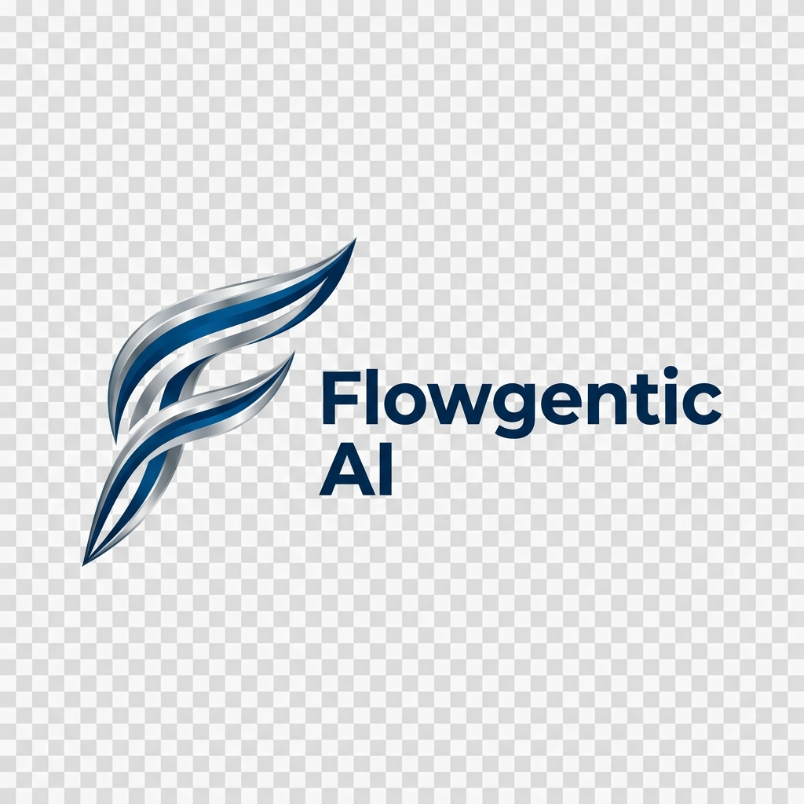

  

# Flowgentic Meet

Flowgentic Meet is a premium, open-source video conferencing solution developed by **Flowgentic Ai company**. Built on the foundation of LiveKit and Next.js, it offers a robust, high-performance meeting environment designed for modern teams and seamless digital interaction.

## Key Features
- **High-Performance Video/Audio**: Low-latency communication powered by LiveKit.
- **Modern Interface**: A clean, intuitive, and responsive design.
- **Scalable Infrastructure**: Built to handle everything from 1-on-1 calls to large-scale meetings.

---
© 2024 Flowgentic Ai company. All rights reserved.
